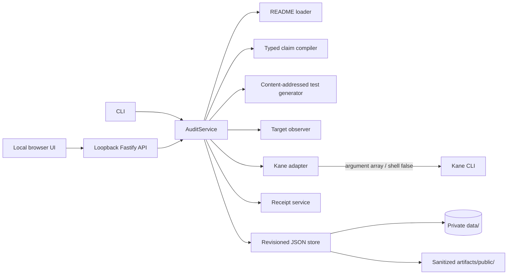

<p align="center">
  
</p>

<h1 align="center">Probat</h1>
<p align="center"><strong>Documentation, with evidence.</strong></p>

Probat turns a sentence in a README into a browser result that can be traced back to the exact source, target revision, assertion plan, test bytes, and Kane execution that produced it.

A claim does not become true because a test printed green. Probat preserves the quotation and citation, compiles only supported language into a constrained assertion, observes the deployed revision, runs immutable test bytes through Kane, and issues a receipt only when every binding still agrees.

<p align="center">
  <a href="#open-the-interface"><strong>Open the interface</strong></a> ·
  <a href="#how-kane-is-used"><strong>Kane execution model</strong></a> ·
  <a href="#how-kiro-shaped-the-system"><strong>Kiro workflow</strong></a>
</p>

---

## Open the interface

Probat is local-first. The product UI, Fastify API, JSON store, and deterministic target run on your machine.

**Requirements:** Node.js 20+, npm, Git, a Kane-supported browser, and the Kane CLI for live browser verification.

```powershell
npm ci
npm run validate
```

Start the deterministic application in terminal one:

```powershell
npm run demo
```

Start Probat in terminal two:

```powershell
npm run dev
```

Open **[http://127.0.0.1:4310/ui/](http://127.0.0.1:4310/ui/)**.

The interface is not a separate frontend project. It is a same-origin, dependency-free product surface served by Fastify with a strict Content Security Policy. From it you can:

- ingest a workspace README or supported public GitHub Markdown URL;
- inspect exact claims, citations, assertion kinds, and hashes;
- approve, reject, or mark each claim unverifiable;
- run Kane with explicit execution options;
- compare test hashes before and after a run;
- refresh source/target/test freshness independently from verdict;
- inspect append-only run history and receipt supersession.

The demo target is available at `http://127.0.0.1:4321`. It serves an observable marker at `/.well-known/probat-revision` with the value `probat-demo-v1`.

## One claim, end to end

The fixture contains this exact statement:

```text
The page title contains "Example Domain".
```

Probat processes it in five explicit stages:

1. **Cite** — retain the source locator, exact quotation, line range, README hash, and available Git fingerprint.
2. **Constrain** — compile the quotation into `title_contains("Example Domain")`; unsupported prose remains `unverifiable`.
3. **Observe** — fetch the target's same-origin revision marker and bind its response bytes to the audit.
4. **Run** — create a content-addressed Kane `_test.md`, hash it, execute it, and hash it again after completion.
5. **Receipt** — append a receipt only when the process exit, terminal status, structured claim result, and every proof binding agree.

No review action can replace the README quotation or supply an easier expected result.

## How Kane is used

Probat uses Kane as the browser execution boundary, while keeping verdict policy inside deterministic TypeScript code.

### The generated test is constrained

Only two assertion forms are currently accepted:

```text
The page title contains "<literal>".
The page displays a link labeled "<literal>".
```

The full README sentence is never handed to the browser agent as an instruction. Probat compiles a typed assertion plan, hashes it, and places only the literal operand into a fixed Kane test template as base64-encoded data. The resulting file is content-addressed and create-only.

### The process boundary is explicit

Kane is spawned with an argument array and shell interpolation disabled. Scripted runs always include `--agent`. `--author`, `--retry`, and `--push` are passed only when the user deliberately selects those official Kane modes.

A terminal sentence is not enough to mint evidence. Probat requires:

- a real process exit;
- a `run_end` event;
- a matching `test_md_done` event;
- one unambiguous structured `claim_satisfied` value;
- agreement between exit code, overall status, and claim result;
- unchanged source, target marker, assertion plan, and test hash after execution.

The only receipt-bearing terminal tuples are:

| Verdict | Exit | Terminal | `claimSatisfied` |
|---|---:|---|---:|
| `verified` | `0` | `passed` | `true` |
| `disproved` | `1` | `failed` | `false` |

Timeouts, setup exits, malformed output, missing completion, changed bindings, `automation_bug`, and `agent_misstep` are `blocked`. They are never converted into product contradictions.

### Attempt history is not cleaned up

Every run receives its own identity. A new receipt supersedes the previous receipt; it does not edit it. Recovery journals carry the exact predecessor audit and can apply only one coherent run/receipt append. Unsafe journals are quarantined rather than exported.

That distinction matters in the preserved evidence chain:

| Record | What happened |
|---|---|
| `rcpt_2aab3cb8-714d-4e0b-9612-4393cbc8f52f` | Fresh authored attempt returned a false tuple, while Kane identified an `automation_bug/agent_misstep`. The record is preserved; current classification blocks this failure mode. |
| `rcpt_08b66a1a-3d48-42cb-85a0-8bee0257cac4` | Official retry completed with a coherent verified tuple. |
| `rcpt_18751727-de18-4362-9fe3-930a7e70daa3` | Current pushed replay completed with exit `0`, terminal `passed`, and `claimSatisfied: true`. |

All attempts bind the unchanged test hash:

```text
4ffbd872da419d4f8a1eedf52ebd60cd2d96ea3ee0bd01fc5ac40a20d8ee8f43
```

The authored-attempt Kane share remains publicly inspectable:

[Open the preserved Kane result](https://test-manager.lambdatest.com/projects/01M0DA9RYXM0X55Q9PJNR4ZKZK/test-cases/01M0G2MJMFPM1GGS1WX7MBX4MK/dashboard/share/US_7557I02V979TTVOCZTOYLRMFK3CBYD3F5LH0QEG3UFBIMCQ47F649IKY8NLT0DZF)

## Proof receipts

A v4 receipt binds:

- audit, claim, quotation, and citation;
- README content hash;
- typed assertion hash and assertion-plan hash;
- observed target fingerprint and marker-response hash;
- immutable test path, format, and content hash;
- Kane run identity;
- coherent process exit, terminal status, and structured claim result;
- superseded receipt identity, when one exists.

Private receipts are create-only. Audit revisions use compare-and-swap. Public projections remove raw Kane prose, progress, credentials, local session directories, and private paths.

Inspect the current sanitized records in [`artifacts/public`](artifacts/public):

- [canonical audit](artifacts/public/audits/aud_final-judge-smoke_810584a1.json)
- [current receipt](artifacts/public/receipts/rcpt_18751727-de18-4362-9fe3-930a7e70daa3.json)
- [preserved authored attempt](artifacts/public/receipts/rcpt_2aab3cb8-714d-4e0b-9612-4393cbc8f52f.json)

## Verdicts and freshness

| State | Meaning |
|---|---|
| `verified` | Kane completed the immutable test with the exact verified tuple. |
| `disproved` | Kane completed with the exact contradiction tuple. |
| `blocked` | Execution or proof prerequisites prevented a valid product verdict. |
| `unverifiable` | The statement does not compile into an objective supported browser assertion. |
| `error` | An internal integrity boundary failed. |

Freshness is separate. A previously verified receipt may become stale when its README, target observation, assertion plan, or test bytes no longer match.

## How Kiro shaped the system

Kiro was the engineering control plane for Probat, not a one-shot code generator.

### Specification before implementation

The committed [requirements](.kiro/specs/probat-backend/requirements.md), [design](.kiro/specs/probat-backend/design.md), and [task plan](.kiro/specs/probat-backend/tasks.md) established the source → claim → test → run → receipt lifecycle before the adapters and storage code were written. That kept the Kane integration behind a domain service instead of spreading runner behavior across routes and commands.

### Persistent engineering constraints

Kiro steering files encode rules that must survive across sessions:

- [product semantics](.kiro/steering/product.md) define verified, disproved, blocked, unverifiable, and freshness;
- [technical direction](.kiro/steering/tech.md) fixes TypeScript, Fastify, Zod, file-backed storage, and shell-disabled Kane execution;
- [repository structure](.kiro/steering/structure.md) keeps dependencies pointing inward;
- [verification integrity](.kiro/steering/verification.md) forbids weakening generated tests, fabricating exits, deleting failed evidence, or publishing raw Kane output.

### Hooks and review loops

The committed Kiro hooks run strict TypeScript validation on source changes and the full check → test → build gate after completed work. Semantic review loops found trust-boundary failures that ordinary happy-path testing would miss, including:

- mixed v4 terminal tuples accepted field-by-field;
- receipts that did not match their referenced appended run;
- recovery journals without exact predecessor ancestry;
- agent-misstep output misclassified as a product contradiction;
- public locators capable of leaking local paths;
- legacy free-form Kane tests that delegated too much interpretation to the agent.

Those findings became schema refinements, transaction invariants, quarantine behavior, classifier rules, sanitizers, and regression assertions. The `.kiro` directory is the visible trace of that process.

## Architecture



```text
UI / CLI / API → services → domain / store / adapters
```

There is no application database, hosted Probat backend, billing layer, remote font, analytics script, or frontend framework. Live browser execution uses the authenticated Kane service; deterministic validation and preserved records remain runnable without creating new browser evidence.

## CLI

```text
doctor
ingest --project <name> --readme <path|github-url> --target <url> [--revision <id>]
list
show --audit <id>
review --audit <id> --claim <id> --decision <approve|reject|unverifiable>
verify --audit <id> [--claim <id>] [--headless] [--author] [--retry] [--push] [--timeout <10-600>]
freshness --audit <id>
receipt --id <id>
serve [--host 127.0.0.1] [--port 4310]
```

Install and authenticate Kane for a live run:

```powershell
npm install -g @testmuai/kane-cli@0.8.4
kane-cli login
npm run doctor
```

`doctor` exits with code `2` when Kane, authentication, or the runner is unavailable. That is setup state, not a product verdict.

## HTTP surface

The server binds only to `127.0.0.1` or `localhost`. It rejects Authorization credentials, non-loopback Host values, and cross-origin browser mutations.

| Method | Route | Purpose |
|---|---|---|
| GET | `/ui/` | Product interface |
| GET | `/health` | Process health |
| GET | `/api/doctor` | Kane readiness |
| GET / POST | `/api/audits` | List or ingest audits |
| GET | `/api/audits/:auditId` | Audit detail |
| PATCH | `/api/audits/:auditId/claims/:claimId` | Claim decision |
| POST | `/api/audits/:auditId/verify` | Verify one or all eligible claims |
| POST | `/api/audits/:auditId/freshness` | Re-evaluate bindings |
| GET | `/api/receipts/:receiptId` | Receipt detail |

The UI renders API values through DOM text nodes, not HTML interpolation. Assets are exact routes protected by a CSP with no inline script, inline style, `eval`, framing, objects, or cross-origin connections.

## Validation

```powershell
npm run validate
npm audit --omit=dev
npm run doctor
```

The deterministic suite does not invoke Kane or manufacture evidence. It covers target observation, constrained claim compilation, Kane terminal parsing, verdict coherence, v4 receipt bindings, transaction recovery, public redaction, UI asset security, loopback Host enforcement, same-origin mutation protection, and Fastify workflow validation.

A live Kane run is a separate integration event with a new run identity.

## Files and privacy boundary

```text
src/ui           same-origin product interface
src/domain       Zod records and errors
src/services     claim, audit, test, and receipt workflows
src/adapters     Kane and target-observation boundaries
src/store        atomic revisioned JSON persistence
src/api          loopback HTTP surface
kane-tests       persistent content-addressed Kane tests
artifacts/public inspected publication projections
data              ignored authoritative local state
.kiro             specs, steering, and validation hooks
```

Commit-safe: source, `.kiro`, fixtures, persistent `*_test.md` files, and inspected public projections.

Private or generated: `data/`, `.env`, `.testmuai/evidence/`, `.testmuai/variables/`, `.context/sessions/`, `kane-tests/**/output-*/`, `artifacts/private/`, and `semantic-review/`.

Remote README ingestion accepts only bounded, credential-free public GitHub HTTPS Markdown URLs. Local paths and symlinks must resolve inside the workspace. README text is always untrusted data and is never executed.

## Run the product walkthrough

See [docs/DEMO.md](docs/DEMO.md) for the UI-first recording flow and [docs/RELEASE_CHECKLIST.md](docs/RELEASE_CHECKLIST.md) for the clean-publication gate.
