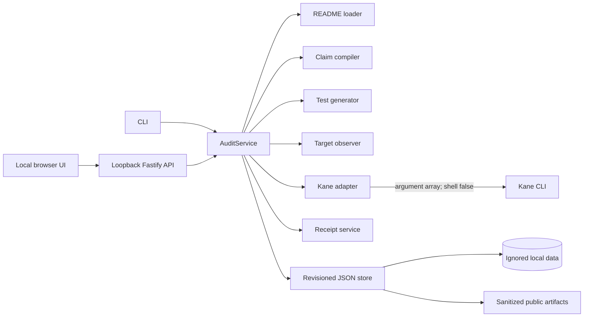

<p align="center">
  
</p>

<h1 align="center">Probat</h1>
<p align="center"><strong>Documentation, with evidence.</strong></p>
<p align="center">
  A local-first verification tool that turns browser-checkable README claims into<br>
  constrained Kane tests, fail-closed verdicts, and source-bound Proof Receipts.
</p>

<p align="center">
  <a href="#quick-start">Quick start</a> ·
  <a href="#verification-model">Verification model</a> ·
  <a href="#proof-receipts">Proof Receipts</a> ·
  <a href="#interfaces">Interfaces</a> ·
  <a href="#security-and-privacy">Security</a>
</p>

---

## Why Probat

Documentation makes promises about software, but those promises are rarely connected to executable evidence. A passing browser test alone is not enough: without the original quotation, source content hash, target identity, immutable test bytes, and runner outcome, the result is difficult to audit or reproduce.

Probat creates that chain of custody. It:

- preserves each exact README quotation and source location;
- compiles supported prose into a closed, typed browser assertion;
- binds execution to an observed deployment manifest and independently fetched entrypoint;
- runs content-addressed Markdown tests through [Kane CLI](https://www.lambdatest.com/kane-cli/);
- issues an immutable receipt only when the source, target, assertion, test, and terminal result agree;
- publishes inspected JSON projections while keeping local evidence and credentials private.

Probat answers one narrow question:

> Did a real browser run demonstrate this exact README assertion against this identified target using these exact test bytes?

It is not an AI opinion, a performance benchmark, or a security certification.

## Quick start

### Requirements

- Node.js 20 or newer
- npm and Git
- Kane CLI 0.8.4, authentication, and a supported browser for live execution

```powershell
npm ci
npm run validate
npm install -g @testmuai/kane-cli@0.8.4
kane-cli login
npm run doctor
```

`doctor` exits with code `2` when Kane, authentication, or the runner is unavailable. That indicates setup state—not a disproved product claim.

### Run the complete local demo

```powershell
npm run demo
```

This starts the Probat UI/API and deterministic browser target in one process. By default:

- Product UI: [http://127.0.0.1:4310/ui/](http://127.0.0.1:4310/ui/)
- API root: [http://127.0.0.1:4310/](http://127.0.0.1:4310/) (redirects to the UI)
- Browser target: [http://127.0.0.1:4321/](http://127.0.0.1:4321/)
- Deployment manifest: [http://127.0.0.1:4321/.well-known/probat-manifest.json](http://127.0.0.1:4321/.well-known/probat-manifest.json)

Press `Ctrl+C` once to stop both servers. To use different ports in PowerShell:

```powershell
$env:PROBAT_PORT="4410"
$env:DEMO_TARGET_PORT="4421"
npm run demo
```

The New audit form receives the actual runtime target URL. `npm run dev` starts Probat alone; `npm run demo:target` starts only the deterministic target.

## Verification model

Probat uses five explicit stages:

| Stage | Responsibility | Bound evidence |
|---|---|---|
| **Cite** | Preserve the statement exactly as written. | Quotation, heading, line range, and README content hash. An available Git fingerprint is retained as provenance metadata, not a receipt binding. |
| **Constrain** | Compile supported prose into a typed plan. | Assertion kind, literal operand, quotation hash, plan hash. |
| **Observe** | Read a strict same-origin manifest and independently fetch its entrypoint. | Origin, revision, manifest hash, entrypoint URL and hash. |
| **Run** | Execute immutable test bytes through Kane. | Content-addressed `_test.md`, pre/post hashes, process and terminal result. |
| **Receipt** | Commit evidence only when every binding agrees. | Verdict tuple, run ID, source/target/test hashes, lineage. |

Human review decides whether a claim may execute. Review cannot rewrite the quotation, replace the expected literal, or weaken the generated test.

### Supported assertions

Probat deliberately accepts six exact forms:

```text
The page title contains "<literal>".
The page displays a link labeled "<literal>".
The page displays a heading labeled "<literal>".
The page displays the text "<literal>".
The page displays a button labeled "<literal>".
The page URL path is "/<canonical-path>".
```

Title and link assertions retain immutable test format 2. Heading, text, button, and path assertions use additive format 3. Unsupported or subjective statements remain visible as `unverifiable`; they are never converted into free-form agent instructions.

Generated tests are committed under `kane-tests/<project>/`:

```text
<claim-slug>-<claim-id>-<sha256>_test.md
```

The literal operand is encoded as data inside a fixed, versioned template. Probat rejects conflicting bytes at an existing content-addressed path.

### Target binding

A target must expose strict JSON at `/.well-known/probat-manifest.json`:

```json
{
  "version": 2,
  "revision": "deployment-revision",
  "entrypoint": "/"
}
```

The entrypoint must be root-relative, same-origin, traversal-free, and have no query or fragment. Probat hashes the exact manifest response and independently fetched entrypoint bytes. The resulting v3 fingerprint binds the target origin, declared revision, manifest, and entrypoint; it does not claim to hash every deployed asset.

### Kane execution boundary

A scripted run is equivalent to:

```text
kane-cli testmd run <test-path> --agent --url <target-url> --timeout <seconds>
```

Probat constructs an argument array and starts Kane with shell interpolation disabled. `--agent` is mandatory. Official `--headless`, `--author`, `--retry`, and `--push` modes are included only when explicitly selected.

Probat parses Kane's NDJSON defensively and requires one coherent terminal sequence. Only these tuples can produce product verdicts:

| Verdict | Process exit | Terminal status | `claimSatisfied` |
|---|---:|---|---:|
| `verified` | `0` | `passed` | `true` |
| `disproved` | `1` | `failed` | `false` |

Timeouts, setup failures, malformed or ambiguous terminal output, missing completion, automation errors, and changed bindings are `blocked`. They are never converted into product failures.

After Kane exits, Probat rechecks the README hash, assertion plan, manifest and entrypoint fingerprint, and test hash. Changed evidence blocks receipt issuance.

## Verdicts and freshness

| State | Meaning |
|---|---|
| `verified` | Kane demonstrated the claim with the exact accepted tuple and unchanged bindings. |
| `disproved` | A completed Kane run observed the exact contradictory tuple with unchanged bindings. |
| `blocked` | Setup, execution, protocol, or binding prerequisites prevented a valid verdict. |
| `unverifiable` | The statement cannot be objectively compiled into a supported browser assertion. |
| `error` | An internal integrity boundary failed. |

Freshness is independent from verdict. A verified receipt remains historical evidence, but its source, target, assertion, or test binding can later become stale.

## Proof Receipts

Current policy uses ReceiptV6 for test format 2 and ReceiptV7 for test format 3. A receipt binds:

- audit, claim, exact quotation, and citation;
- README content hash; an available Git fingerprint is retained as source provenance metadata but is not bound into the receipt;
- typed assertion and assertion-plan hashes;
- target origin, revision, exact manifest hash, and entrypoint URL/hash;
- immutable test format, canonical hash, and matching pre/post-run hashes;
- Kane run ID, exact terminal tuple, protocol metadata, and evidence policy;
- supersession or correction lineage without changing older receipts.

Private receipts are create-only. Audit writes use revision compare-and-swap, verification commits use recoverable journals, and unsafe recovery state is quarantined. New receipts supersede rather than overwrite previous evidence.

### Published evidence

[`artifacts/public`](artifacts/public) contains sanitized projections rebuilt from the local authoritative store:

- [`index.json`](artifacts/public/index.json) — audit summary and evidence counts;
- [`audits/`](artifacts/public/audits) — source, target, claim, and run projections;
- [`receipts/`](artifacts/public/receipts) — immutable receipt projections and lineage.

Historical v1-v5 and policy-1 records remain available as legacy evidence. Coherent manifest-bound V6/V7 policy-2 receipts are classified as current policy. Publication strips raw Kane prose, credentials, private storage paths, local session directories, and raw evidence packs.

### Latest fresh integration attempt

The latest real Kane attempt is preserved honestly in [`aud_final-submission-fresh_827e20d1`](artifacts/public/audits/aud_final-submission-fresh_827e20d1.json):

- run ID `run_10c2bc3d-7e60-49d1-8e52-cf7de3950f5b`;
- process exit `0`, but an invalid terminal protocol containing two `run_end` events and one `test_md_done`;
- identical pre-run and post-run SHA-256 `d30a0b403dde43908a1c8db180cfd87242f4680a079d83fb4ebb054ff81e0e2c`;
- verdict `blocked` and no receipt issued.

This is distinct from preserved historical verified evidence. A browser-side pass cannot override an ambiguous terminal protocol, and Probat does not retry or weaken the test to manufacture a green result.

## Architecture



Dependencies point inward:

```text
UI / CLI / API → services → domain / store / adapters
```

The stack is intentionally small: strict TypeScript, Node.js, Fastify, Zod, and file-backed JSON. No application database, cloud Probat service, billing system, or paid API is required.

## Interfaces

### CLI

```text
doctor
ingest --project <name> --readme <path|github-url> --target <url> [--revision <id>]
list
show --audit <id>
review --audit <id> --claim <id> --decision <approve|reject|unverifiable>
verify --audit <id> [--claim <id>] [--headless] [--author] [--retry] [--push] [--timeout <10-600>]
freshness --audit <id>
receipt --id <id>
serve [--host 127.0.0.1] [--port 4310]
```

Examples:

```powershell
npm run probat -- ingest --project example --readme fixtures/example/README.md --target http://127.0.0.1:4321/
npm run probat -- list
npm run probat -- show --audit <audit-id>
```

### HTTP API

| Method | Route | Purpose |
|---|---|---|
| `GET` | `/ui/` | Product interface. |
| `GET` | `/health` | Process health. |
| `GET` | `/api/doctor` | Kane readiness. |
| `GET`, `POST` | `/api/audits` | List or create audits. |
| `GET` | `/api/audits/:auditId` | Read an audit. |
| `PATCH` | `/api/audits/:auditId/claims/:claimId` | Record review. |
| `POST` | `/api/audits/:auditId/verify` | Verify eligible claims. |
| `POST` | `/api/audits/:auditId/freshness` | Re-evaluate bindings. |
| `GET` | `/api/receipts/:receiptId` | Read a receipt. |

The browser UI exposes the same workflow: ingest, inspect citations and hashes, review claims, check Kane readiness, execute approved claims, and inspect run/receipt lineage.

## Security and privacy

- The server binds only to `127.0.0.1` or `localhost`.
- Foreign Host values, Authorization headers, and cross-origin browser mutations are rejected.
- The UI uses a strict Content Security Policy and same-origin static assets.
- API values are rendered with DOM text nodes rather than HTML interpolation.
- Local README paths and symlinks must resolve inside the workspace.
- Remote ingestion accepts bounded, credential-free public GitHub Markdown URLs.
- README content is untrusted data and is never executed.
- Kane runs without a shell; credentials are redacted from retained summaries.
- `data/`, `.env*`, `.testmuai/evidence/`, `.testmuai/variables/`, `.context/sessions/`, Kane output directories, and `artifacts/private/` are excluded from Git.
- Public projections omit raw evidence, local Windows paths, session details, and private runner prose.

## Validation

```powershell
npm run validate
npm audit --omit=dev
npm run doctor
```

`npm run validate` performs strict type checking, the deterministic integrity suite, and a production build. The suite covers constrained assertions, target observation, immutable test formats, terminal parsing, verdict coherence, ReceiptV1-V7 compatibility, journal recovery, lineage, public redaction, UI security, loopback enforcement, and API workflows.

The deterministic suite does not invoke Kane or fabricate browser evidence. Live Kane verification is a separate integration event with a unique run identity.

To rebuild inspected public projections from local state:

```powershell
npm run probat -- list
```

## Scope

Probat v1.0.0 intentionally does not provide private-repository OAuth, multi-tenancy, billing, cloud Kane execution, arbitrary target-repository code execution, performance benchmarking, or security certification. Live execution depends on Kane installation, authentication, browser support, and runner availability.

## Repository map

```text
src/ui             same-origin product interface
src/domain         validated records and shared errors
src/lib            hashing, process, path, and serialization utilities
src/services       README, claims, tests, receipts, audits, and freshness
src/adapters       Kane and target-observation boundaries
src/store          atomic revisioned JSON persistence
src/api            Fastify routes and HTTP error mapping
kane-tests         persistent content-addressed Kane tests
artifacts/public   inspected, commit-safe projections
data               ignored authoritative local state
.kiro              specifications, steering, hooks, and engineering controls
```

## Engineering provenance

The committed [`.kiro`](.kiro) directory records the requirements, architecture, task plan, persistent technical constraints, and validation hooks used to build Probat. These controls keep evidence semantics—especially fail-closed verdicts, immutable tests, shell-disabled Kane execution, and private/public separation—active during development rather than relying on undocumented process.
